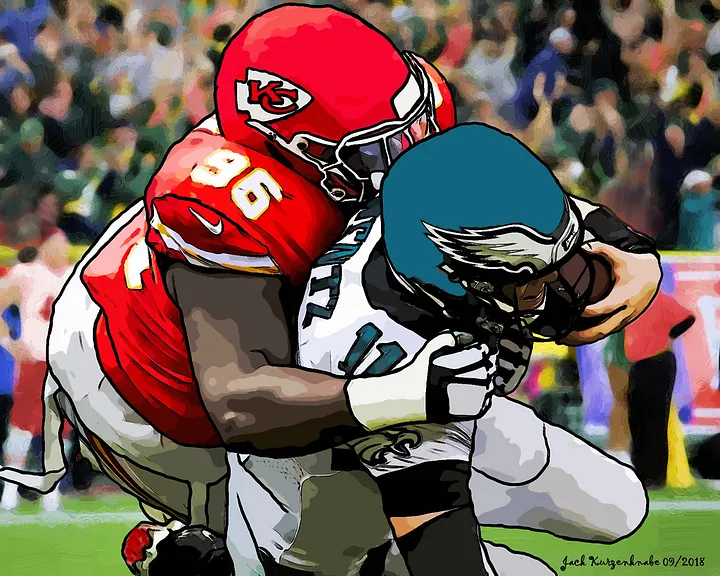

## Data Scince Projects

---

### Predict Super Bowl 2023 results using Random Forest

  
The NFL Super Bowl is only a few days away and I am actually feeling excited about it this year. As a curios person I cannot wait for a few more days to see the winner so I thought it’d be interesting to try to predict the winner beforehand. I used Python and RandomForest Classifier to predict the winner, and then use Regressor to make a guess on the score. Here is my way to predict the Super Bowl outcome.  

<a href="https://github.com/seemyon/superbowl2023_score_prediction/blob/main/Super_Bowl_2023_randomforest.ipynb">View on Github</a>

---

<small>Hosted on GitHub Pages &mdash; Theme by <a href="https://github.com/orderedlist">orderedlist</a></small>

